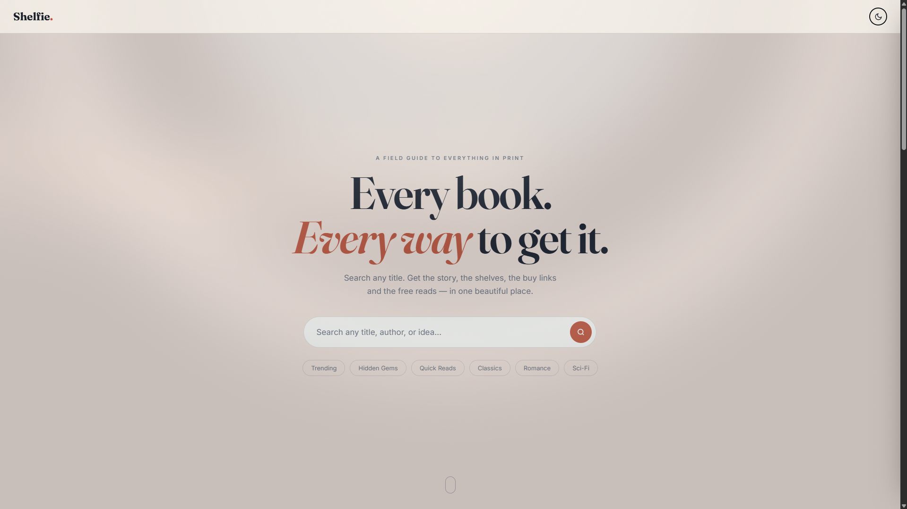
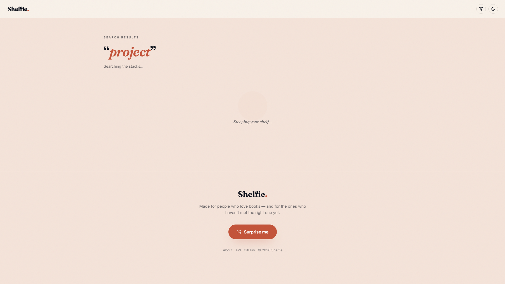
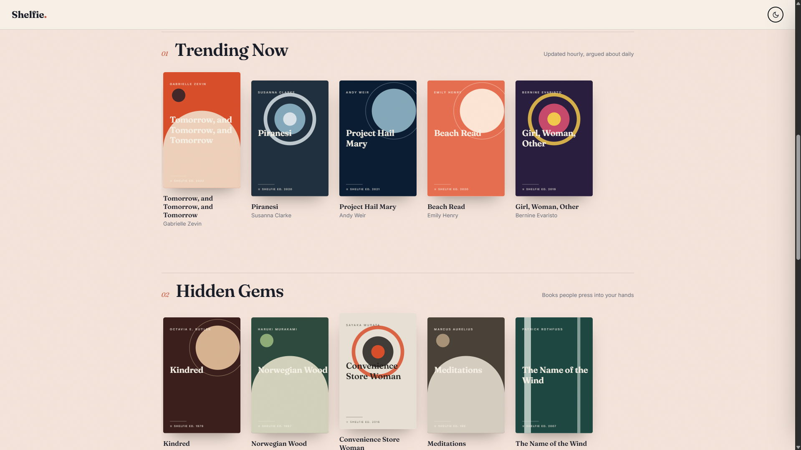
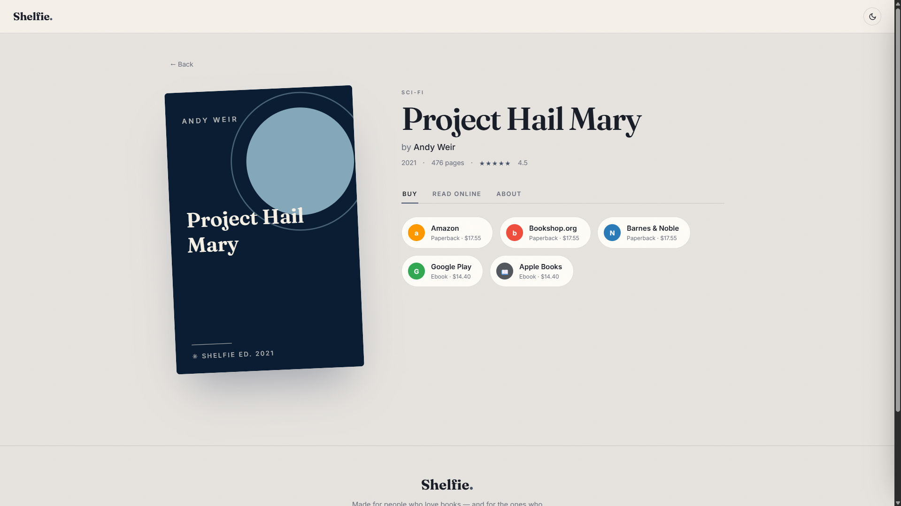

Shelfie
A field guide to everything in print — search any title and get the story, the shelves, the buy links, and the free reads in one place.
Demo

Search surfaces real-time results pulled and merged from multiple sources:

Curated shelves for discovery — Trending, Hidden Gems, Quick Reads, and more:

Each book has a dedicated detail page with buy links across retailers and free-read options:

Tech Stack
Frontend: React, TypeScript, Vite
Backend: FastAPI, Python — merges and deduplicates results across multiple book-data sources with fuzzy matching (`rapidfuzz`)

Optional: set OPENAI_API_KEY to enable LLM fallback summaries when both APIs
return a missing/short description. Otherwise a honest heuristic blurb is used.

## Architecture notes

- backend/merger.py calls both APIs in parallel (asyncio.gather + httpx),
  normalizes to one schema, merges on ISBN (exact) or title+author (rapidfuzz
  token_set_ratio > 92). Google Books wins on description/buy links; Open
  Library wins on read-online links and fallback covers.
- Color theming: frontend/src/utils/colorTheme.ts uses node-vibrant
  (downsample -> MMCQ cluster -> dominant swatch, near-black/white filtered)
  and writes --accent / --tint / --shadow-tint CSS vars; every surface that
  uses them transitions, so opening a book page animates the whole room
  toward the cover's palette.
- Motion language: staggered rise-in for results, cursor-tracked 3D tilt on
  covers, ink-bleed loader, spring drawer, page-turn view transitions.
